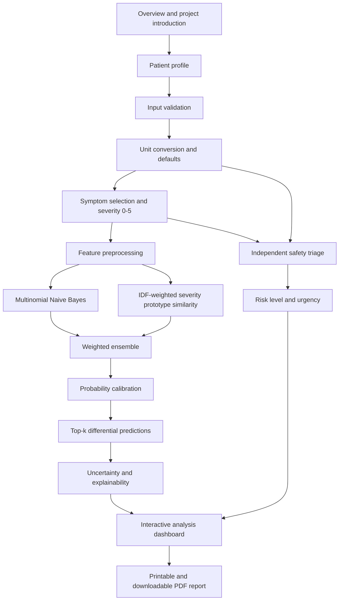
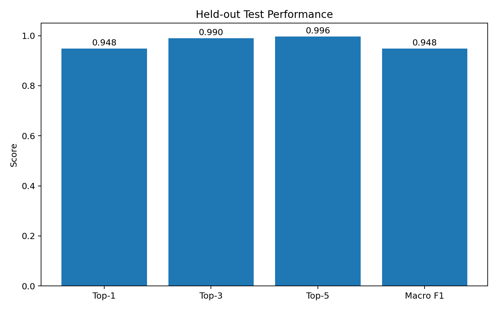
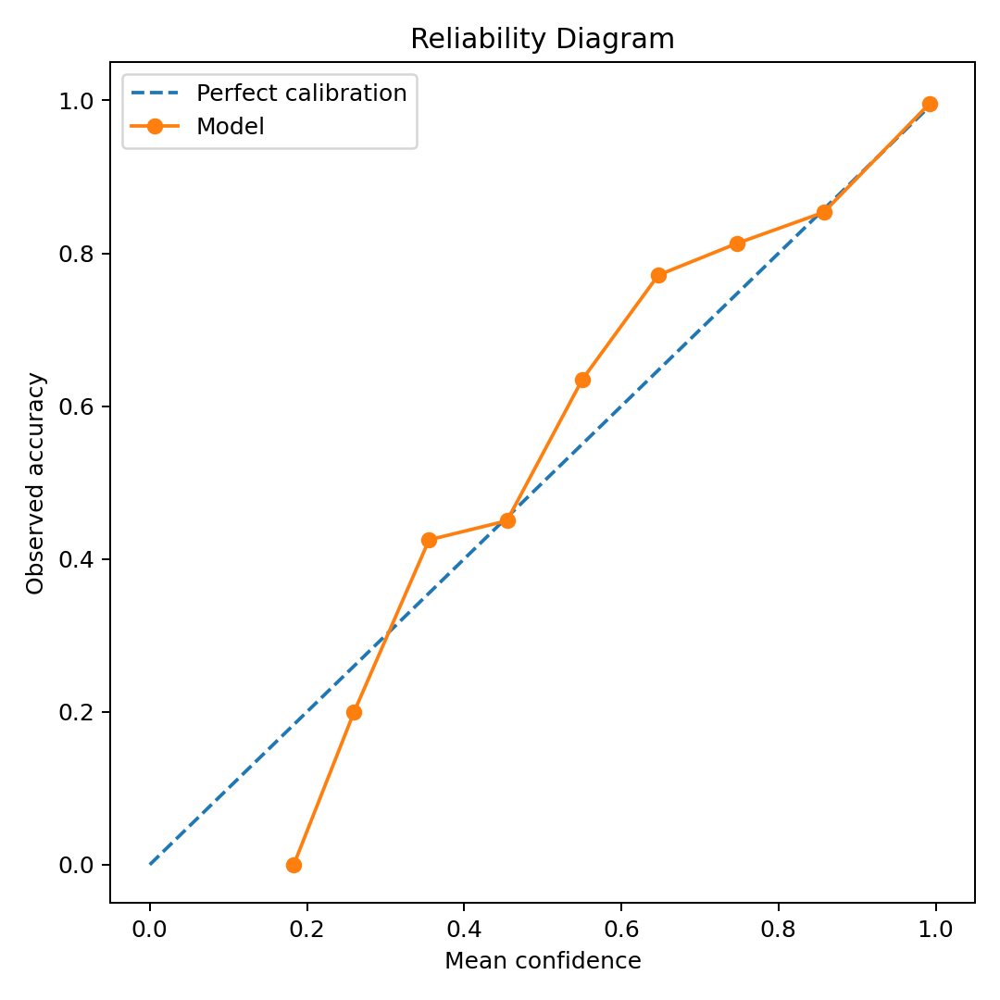
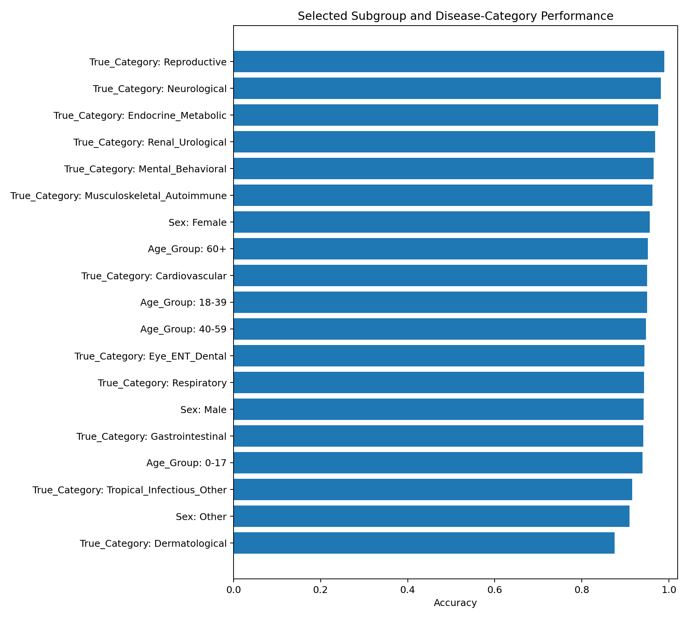
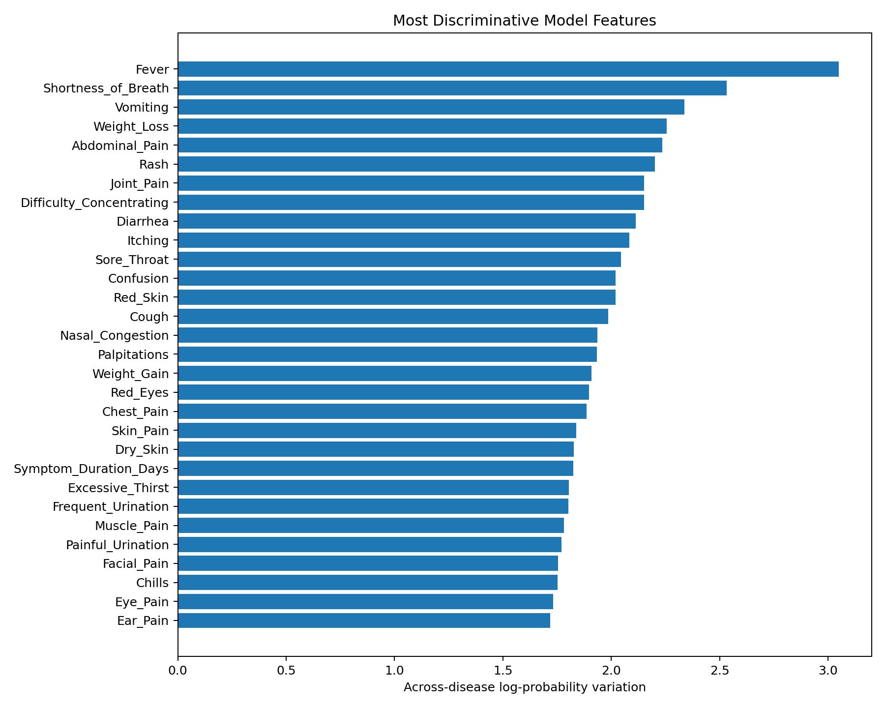
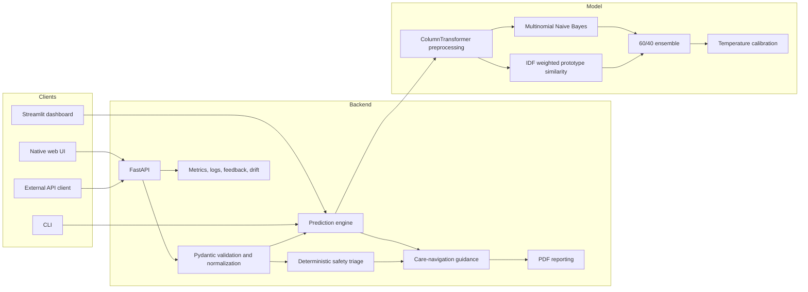

# MediSense AI

<p align="center">
  <strong>Professional Disease Prediction, Differential Ranking, Explainable Analytics and Safety Triage System</strong>
</p>

<p align="center">
  <a href="https://www.python.org/"></a>
  <a href="https://fastapi.tiangolo.com/"></a>
  <a href="https://scikit-learn.org/"></a>
  <a href="LICENSE"></a>
  
</p>

<p align="center">
  <strong>Designed & Developed by Estiuk Arafat Arnob</strong><br>
  <a href="https://www.linkedin.com/in/estiuk-arafat-arnob-0350ba34a/">LinkedIn</a> ·
  <a href="https://github.com/ea-arnob-07/">GitHub</a> ·
  <a href="https://www.facebook.com/ea.arnob.07/">Facebook</a>
</p>

---

## 🌐 Live Server / Demo

> [!IMPORTANT]
> 🚀 **Experience the Live Application!**  
> The project is currently hosted and live on Render. You can access the API and Dashboard here:
> 
> **👉 [https://medisense-api-5jcj.onrender.com](https://medisense-api-5jcj.onrender.com)**

> [!WARNING]
> **Medical and safety notice:** MediSense AI is an educational software prototype trained and evaluated on synthetic, medically informed data. It is **not clinically validated**, is not a medical device, and must not be used to confirm or exclude a diagnosis, select medication, determine treatment, or replace a licensed healthcare professional. Emergency symptoms require immediate professional care regardless of model output.

## Table of Contents

- [🌐 Live Server / Demo](#-live-server--demo)
1. [Project Overview](#project-overview)
2. [Problem Statement](#problem-statement)
3. [Project Objectives](#project-objectives)
4. [Core Features](#core-features)
5. [Application Workflow](#application-workflow)
6. [Dataset](#dataset)
7. [Input Features and Unit Normalization](#input-features-and-unit-normalization)
8. [Machine Learning Methodology](#machine-learning-methodology)
9. [Model Performance](#model-performance)
10. [Understanding Dashboard Scores](#understanding-dashboard-scores)
11. [Clinical Safety and Triage Layer](#clinical-safety-and-triage-layer)
12. [Explainable AI and Uncertainty](#explainable-ai-and-uncertainty)
13. [Web Interface and User Experience](#web-interface-and-user-experience)
14. [PDF Reporting](#pdf-reporting)
15. [Technology Stack](#technology-stack)
16. [System Architecture](#system-architecture)
17. [Project Structure](#project-structure)
18. [Installation and Local Setup](#installation-and-local-setup)
19. [Running with Docker](#running-with-docker)
20. [API Documentation](#api-documentation)
21. [Model Retraining and Audit](#model-retraining-and-audit)
22. [Testing and Code Quality](#testing-and-code-quality)
23. [Monitoring, Drift and Feedback](#monitoring-drift-and-feedback)
24. [Privacy and Security](#privacy-and-security)
25. [Limitations](#limitations)
26. [Future Improvements](#future-improvements)
27. [Publishing to GitHub](#publishing-to-github)
28. [References](#references)
29. [License](#license)
30. [Author](#author)

---

## Project Overview

**MediSense AI** is a full-stack educational health-assessment system that accepts patient context, vital signs, physical measurements, and symptom severity values, then produces:

- a ranked **top-5 differential prediction** instead of a single absolute diagnosis;
- patient-specific probability and uncertainty information;
- a separate deterministic clinical-risk and emergency-warning screen;
- explainable evidence based on matched disease-signature symptoms;
- bilingual English-Bangla labels for patient accessibility;
- interactive charts, 3D visual effects, a printable dashboard, and a downloadable PDF report;
- REST API, Streamlit dashboard, CLI, batch prediction, drift screening, monitoring metrics, tests, and Docker support.

The included trained artifact covers **179 disease or condition classes**, **208 symptom features**, and a total of **225 predictive input features**.

### Interface preview

<p align="center">
  
</p>

<p align="center">
  
</p>

---

## Problem Statement

Many people struggle to describe symptoms using technical medical language, and a basic single-label disease predictor can create false certainty. Real symptoms often overlap across several conditions, while dangerous warning signs may require urgent attention even when a machine-learning model is uncertain.

MediSense AI addresses this problem through a layered design:

1. **Structured patient assessment** captures demographic, historical, vital, and symptom information.
2. **Differential prediction** ranks multiple possible conditions.
3. **Uncertainty analysis** communicates how clear or ambiguous the current symptom pattern is.
4. **Independent safety triage** checks emergency red flags and abnormal measurements.
5. **Explainable output** shows matched and missing signature symptoms.
6. **Bilingual presentation** makes the interface easier to use for Bangla-speaking users.

---

## Project Objectives

### Primary objective

Build a professional, reproducible, full-stack educational disease-prediction and triage demonstration that combines machine learning, safety rules, explainability, visualization, bilingual accessibility, and downloadable reporting.

### Specific objectives

- Predict and rank the most likely disease patterns from structured patient data.
- Return top-1, top-3, and top-5 clinically styled differential possibilities.
- Represent symptom intensity using a severity scale from 0 to 5.
- Use demographics, history, symptom duration, vitals, BMI, glucose, pain score, and symptoms together.
- Normalize user-friendly units before inference.
- Separate statistical prediction from emergency triage logic.
- Explain predictions through disease-signature symptom matching.
- Display confidence, top-two margin, entropy, unknown inputs, and case-level clarity.
- Generate a complete patient-profile PDF report.
- Support English and Bangla throughout the main interface and result output.
- Provide REST, browser, Streamlit, CLI, and batch workflows.
- Include reproducible training, auditing, tests, Docker, monitoring, and drift checks.
- Clearly state medical limitations and prevent model probability from being presented as a confirmed diagnosis.

---

## Core Features

| Area | Included functionality |
|---|---|
| Disease prediction | Calibrated top-5 differential ranking across 179 classes |
| Symptom representation | 208 symptoms, each scored from 0 to 5 |
| Patient context | Age, sex, pregnancy status, smoking, comorbidities, onset, and duration |
| Measurements | Temperature, heart rate, respiratory rate, SpO2, blood pressure, BMI, glucose, and pain score |
| Friendly units | Fahrenheit input converted to Celsius; feet/inches converted to centimeters |
| BMI | Automatically calculated from converted height and weight |
| Optional vitals | Missing optional measurements receive normal backend defaults |
| Explainability | Matched signature symptoms, missing expected symptoms, and match ratio |
| Uncertainty | Top probability, top-two margin, normalized entropy, unknown input detection |
| Safety | Separate red-flag rules, abnormal vital checks, risk level, urgency, and emergency override |
| Visual analytics | Confidence ring, clinical-risk dial, top-5 bars, vital chart, severity chart, evidence cards |
| Language | English and Bangla labels for symptoms, diseases, categories, risk, and urgency |
| Reporting | Print layout and downloadable patient-profile PDF report |
| Interfaces | FastAPI web app, REST API, Streamlit dashboard, CLI, batch prediction |
| Operations | Prometheus metrics, optional privacy-minimized logs, feedback, and drift screen |
| Engineering | Automated tests, model audit, Docker, Makefile, environment configuration |

---

## Application Workflow



### User journey

1. **Overview page:** introduces the system, capabilities, and safety notice.
2. **Patient data page:** collects personal details, clinical background, required readings, and optional readings.
3. **Symptoms page:** provides searchable English-Bangla symptom cards, categories, compact mode, and severity selection.
4. **Analysis page:** displays differential probabilities, risk status, certainty indicators, vital analysis, symptom severity, explainable evidence, guidance, and PDF download.

The assessment itself is presented as a three-step flow after the welcome screen: patient profile, symptoms, and analysis.

---

## Dataset

### Dataset identity

The project uses the included dataset:

```text
data/disease_prediction_dataset_expanded.csv
```

Supporting dictionaries:

```text
data/disease_profiles.csv
data/symptom_dictionary.csv
```

### Dataset summary

| Property | Value |
|---|---:|
| Total patient records | 25,000 |
| Total columns | 236 |
| Predictive features used by the classifier | 225 |
| Disease classes | 179 |
| Symptom severity features | 208 |
| Numerical predictive features | 11 |
| Categorical predictive features | 6 |
| Uploaded records preserved and augmented | 1,000 |
| Medically informed synthetic records | 24,000 |
| Emergency-red-flag rows | 3,670 |
| Duplicate case IDs | 0 |
| Duplicate rows | 0 |
| Minimum records in a disease class | 75 |
| Maximum records in a disease class | 560 |
| Dataset random seed | 20260723 |

### Data split

The provided `Split` column is used only to separate data and is never used as a predictive feature.

| Split | Records | Approximate share |
|---|---:|---:|
| Train | 17,523 | 70.1% |
| Validation | 3,675 | 14.7% |
| Test | 3,802 | 15.2% |
| **Total** | **25,000** | **100%** |

### Predictive feature groups

#### 208 symptom-severity features

Symptoms are stored as integer severity values:

| Value | Meaning |
|---:|---|
| 0 | Absent |
| 1 | Very mild |
| 2 | Mild |
| 3 | Moderate |
| 4 | Severe |
| 5 | Very severe or critical |

Symptom categories and counts:

| Symptom category | Number of symptoms |
|---|---:|
| Neurological | 30 |
| Gastrointestinal | 28 |
| Respiratory | 21 |
| Skin | 19 |
| General | 17 |
| Musculoskeletal | 17 |
| Eye, ENT and Dental | 17 |
| Urinary and Renal | 13 |
| Reproductive | 13 |
| Cardiovascular | 12 |
| Mental and Behavioral | 11 |
| Endocrine and Metabolic | 10 |
| **Total** | **208** |

#### 11 numerical features

- `Age`
- `Symptom_Duration_Days`
- `Temperature_C`
- `Heart_Rate_BPM`
- `Respiratory_Rate_BPM`
- `SpO2_Percent`
- `Systolic_BP`
- `Diastolic_BP`
- `BMI`
- `Random_Glucose_mg_dL`
- `Pain_Score_0_10`

#### 6 categorical features

- `Sex`
- `Pregnancy_Status`
- `Smoking_Status`
- `Comorbidity_1`
- `Comorbidity_2`
- `Onset_Type`

### Disease categories

| Disease category | Number of classes |
|---|---:|
| Gastrointestinal | 24 |
| Respiratory | 20 |
| Neurological | 18 |
| Dermatological | 16 |
| Endocrine and Metabolic | 16 |
| Tropical, Infectious and Other | 15 |
| Musculoskeletal and Autoimmune | 14 |
| Cardiovascular | 14 |
| Eye, ENT and Dental | 13 |
| Renal and Urological | 11 |
| Reproductive | 10 |
| Mental and Behavioral | 8 |
| **Total** | **179** |

### Missing data

The structural audit reports 31,733 missing cells, all concentrated in optional comorbidity fields:

- `Comorbidity_1`: 10,733 missing values
- `Comorbidity_2`: 21,000 missing values
- Invalid symptom severity values: 0

Missing values are handled inside the preprocessing pipeline.

### Leakage prevention

The following columns are excluded from predictive features because they are identifiers, targets, split markers, post-hoc summaries, or labels that could leak the answer:

- `Case_ID`
- `Data_Origin`
- `Split`
- `Disease`
- `Disease_Severity`
- `Disease_Category`
- `Emergency_Red_Flag`
- `Urgency_Level`
- `Symptom_Count`
- `Max_Symptom_Severity`
- `Mean_Present_Severity`

### Dataset origin and limitation

This is a **synthetic, medically informed educational dataset**. It is not a verified clinical cohort and must not be described as real-world hospital evidence. The 1,000 uploaded rows were preserved and augmented, and the remaining 24,000 rows were synthetically generated. High performance on this dataset does not establish real-patient performance.

---

## Input Features and Unit Normalization

### Patient-facing input fields

| UI field | Backend field | Used by model? | Notes |
|---|---|---:|---|
| Patient name | `patient_name` | No | Used for the report and profile display only |
| Age | `age` | Yes | Range 0-120 |
| Sex | `sex` | Yes | Female, Male, Other |
| Pregnancy status | `pregnancy_status` | Yes | Yes, No, Unknown, Not Applicable |
| Smoking status | `smoking_status` | Yes | Never, Former, Current |
| Comorbidity 1 | `comorbidity_1` | Yes | Optional |
| Comorbidity 2 | `comorbidity_2` | Yes | Optional |
| Symptom duration | `symptom_duration_days` | Yes | 0-3650 days |
| Onset type | `onset_type` | Yes | Gradual, Intermittent, Sudden |
| Temperature in Fahrenheit | `temperature_f` | Converted | Converted to `temperature_c` before prediction |
| Height in feet and inches | `height_feet`, `height_inches` | Indirectly | Converted to centimeters and used to calculate BMI |
| Weight in kilograms | `weight_kg` | Indirectly | Used with height to calculate BMI |
| Heart rate | `heart_rate_bpm` | Yes | Also evaluated by the safety layer |
| Respiratory rate | `respiratory_rate_bpm` | Yes | Optional; default 16 if omitted |
| Oxygen saturation | `spo2_percent` | Yes | Optional; default 98 if omitted |
| Systolic BP | `systolic_bp` | Yes | Optional; default 120 if omitted |
| Diastolic BP | `diastolic_bp` | Yes | Optional; default 80 if omitted |
| Random glucose | `random_glucose_mg_dl` | Yes | Optional; default 100 if omitted |
| Pain score | `pain_score_0_10` | Yes | 0-10 |
| Symptoms | `symptoms` | Yes | Dictionary of symptom name to severity 0-5 |

### Fahrenheit to Celsius

The user can enter temperature in Fahrenheit. Pydantic normalizes it before prediction:

```text
Celsius = (Fahrenheit - 32) x 5 / 9
```

Example:

```text
98.6°F -> 37.0°C
```

If neither Fahrenheit nor Celsius is supplied through the API, the backend default is `37.0°C / 98.6°F`.

### Feet and inches to centimeters

```text
Height_cm = (feet x 30.48) + (inches x 2.54)
```

Example:

```text
5 ft 7 in -> 170.18 cm
```

### BMI calculation

```text
BMI = weight_kg / (height_m ^ 2)
```

Example:

```text
68 kg and 170.18 cm -> BMI 23.5
```

Height and weight are displayed in the profile and PDF. The classifier uses the calculated **BMI**, not raw height or weight as separate model features. If BMI cannot be calculated and no BMI is supplied, the backend default is `23.0`.

### Optional measurement defaults

The following fields remain effective when supplied. When left blank, normal values are inserted so the request can still be processed:

| Optional measurement | Backend default |
|---|---:|
| Respiratory rate | 16 breaths/min |
| Oxygen saturation | 98% |
| Systolic BP | 120 mmHg |
| Diastolic BP | 80 mmHg |
| Random glucose | 100 mg/dL |

The `provided_measurements` array records which optional values were actually entered. The PDF can therefore label a value as user-provided or as a normal default.

---

## Machine Learning Methodology

### Why an ensemble is used

A single classifier can learn relationships between all structured features, but symptom patterns can also be compared directly with the typical severity profile of each disease class. MediSense AI combines both approaches:

1. **Multinomial Naive Bayes** learns from all processed features.
2. **Severity-profile prototype similarity** compares the submitted symptom vector with the average symptom profile of every disease.
3. The two probability distributions are combined and calibrated.

### Step 1: preprocessing

The training pipeline uses `ColumnTransformer` with three branches.

#### Symptom features

- Missing values are filled with `0`.
- Values remain on the original 0-5 severity scale.

#### Numerical features

- Missing values are filled using the training-set median.
- Values are scaled using `MinMaxScaler(feature_range=(0, 5))`.

#### Categorical features

- Missing values are filled using the most frequent training value.
- Categories are transformed using `OneHotEncoder(handle_unknown="ignore")`.

### Step 2: Multinomial Naive Bayes

The first component is:

```text
MultinomialNB(alpha=0.2)
```

It receives the complete transformed feature vector, including symptoms, measurements, demographics, history, and onset information.

### Step 3: IDF-weighted disease prototypes

For each disease class, the training script calculates the mean severity of every symptom. Common symptoms receive less emphasis, while less common symptoms receive more emphasis using an inverse-document-frequency-style weight:

```text
IDF_j = log((1 + N) / (1 + count(symptom_j present))) + 1
```

The class prototype and patient symptom vector are weighted by `sqrt(IDF)`, L2-normalized, and compared using cosine similarity.

The cosine scores are converted into probabilities using softmax with a selected prototype temperature.

### Step 4: validation-based ensemble selection

The training script evaluates:

- prototype temperatures from `0.015` to `0.15`;
- Naive Bayes weights from `0.50` to `1.00` in increments of `0.05`.

Candidates are ranked by validation accuracy and then validation log loss.

Selected parameters:

| Parameter | Selected value |
|---|---:|
| Multinomial NB alpha | 0.2 |
| Naive Bayes weight | 0.60 |
| Prototype-similarity weight | 0.40 |
| Prototype temperature | 0.025 |
| Final calibration temperature | 1.2820146 |

### Step 5: weighted ensemble

Conceptually:

```text
P_combined = 0.60 x P_NB + 0.40 x P_prototype
```

### Step 6: probability calibration

A temperature-scaling value is optimized on validation log loss. Final probabilities are computed from the log of the combined distribution:

```text
P_final = softmax(log(P_combined) / calibration_temperature)
```

Calibration is important because a model can classify correctly while still producing probabilities that are too confident or not confident enough.

### Step 7: top-k differential output

The predictor sorts the final probability distribution and returns the highest-ranked 1 to 10 conditions. The browser uses the top 5 by default.

### Saved model artifact

The complete pipeline and supporting data are stored in:

```text
artifacts/disease_ensemble.joblib
```

The artifact contains:

- preprocessing and Naive Bayes pipeline;
- class names;
- feature schema;
- symptom names;
- weighted disease prototypes;
- IDF values;
- ensemble and calibration parameters;
- disease profiles and signature symptoms;
- symptom metadata;
- default values and categorical options;
- training baseline for drift checks;
- validation and test metrics;
- model version.

---

## Model Performance

### Held-out synthetic test results

| Metric | Validation | Test |
|---|---:|---:|
| Top-1 accuracy | 94.26% | **94.84%** |
| Macro F1 | 94.38% | **94.83%** |
| Weighted F1 | 94.30% | **94.85%** |
| Top-3 accuracy | 98.75% | **98.97%** |
| Top-5 accuracy | 99.48% | **99.63%** |
| Log loss | 0.1951 | **0.1598** |
| Expected calibration error | 1.24% | **1.55%** |
| Mean maximum confidence | 93.06% | **93.67%** |

### Metric definitions

- **Top-1 accuracy:** percentage of test records where the highest-ranked disease equals the synthetic target label.
- **Macro F1:** unweighted average F1 across all 179 classes; gives every disease class equal importance.
- **Weighted F1:** class-support-weighted F1.
- **Top-3 accuracy:** target disease appears within the first three ranked outputs.
- **Top-5 accuracy:** target disease appears within the first five ranked outputs.
- **Log loss:** evaluates the full probability distribution; lower is better.
- **Expected calibration error:** measures the difference between model confidence and observed accuracy across confidence bins; lower is better.

> [!IMPORTANT]
> The 94.84% figure is the model's overall Top-1 performance on the held-out **synthetic test set**. It is not the confidence of every individual patient prediction and does not represent clinically validated accuracy in real patients.

### Evaluation artifacts

The repository includes:

- `artifacts/model_metadata.json`
- `artifacts/classification_report.csv`
- `artifacts/confusion_matrix.csv`
- `artifacts/top_confusions.csv`
- `artifacts/subgroup_metrics.csv`
- `artifacts/data_quality_report.json`
- `artifacts/feature_schema.json`
- `artifacts/test_performance.png`
- `artifacts/reliability_diagram.png`
- `artifacts/support_vs_f1.png`
- `artifacts/subgroup_performance.png`
- `artifacts/top_model_features.png`
- `artifacts/MODEL_CARD.md`

### Evaluation plots

<p align="center">
  
  
</p>

<p align="center">
  
  
</p>

### Example observed confusions

The audit shows that errors often occur between symptom-overlapping classes, for example:

- corneal abrasion and viral conjunctivitis;
- acute HIV syndrome and infectious mononucleosis;
- scabies and contact dermatitis;
- COPD exacerbation and asthma exacerbation;
- COVID-19 and influenza.

This is one reason the system presents a ranked differential rather than claiming one certain diagnosis.

---

## Understanding Dashboard Scores

The analysis page contains several different numbers. They must not be interpreted as the same metric.

### 1. Model accuracy: 94.84%

This is a dataset-level evaluation result measured across all held-out synthetic test records. It describes aggregate performance, not a particular patient.

### 2. Top predicted probability

Example:

```text
Infective Endocarditis: 48.9%
```

This is the highest probability produced for one submitted case. It is a model ranking score, not proof that the person has that disease.

### 3. Clarity index

The UI calculates a patient-specific display score using:

```text
Clarity = 100 x [
    0.62 x top_probability
  + 0.28 x top_two_margin
  + 0.10 x (1 - normalized_entropy)
]
```

The result is clipped to 0-100.

A clarity index of `39` therefore means the current case has an ambiguous or closely competing pattern. It does **not** mean that model accuracy dropped from 94.8% to 39%.

### 4. Top-two margin

```text
Top-two margin = probability of rank 1 - probability of rank 2
```

A small margin means the first and second possibilities are close.

### 5. Normalized entropy

Entropy measures how widely probability is distributed across all disease classes:

- lower entropy: one or a few classes dominate;
- higher entropy: probability is spread across many classes.

### 6. Clinical risk score

The clinical risk score comes from deterministic red-flag and abnormal-measurement rules. It is not model accuracy and not disease probability.

Current category thresholds:

| Score or condition | Risk level |
|---|---|
| 0-2 | Low |
| 3-6 | Moderate |
| 7 or more | High |
| Any emergency red flag | Critical |

The score is **not hard-capped at 10** in the current code. The visual speedometer maps the category to Low, Moderate, High, or Critical rather than representing a strict linear 0-10 medical scale.

---

## Clinical Safety and Triage Layer

### Separation from the classifier

The disease classifier and safety triage are intentionally separate. A case can have low model confidence while still triggering an emergency warning. Similarly, a high model probability does not automatically mean emergency risk.

### Measurement rules

| Measurement | Warning logic |
|---|---|
| SpO2 | `<=90%` emergency red flag; `91-93%` adds 3 risk points |
| Respiratory rate | `>=30/min` emergency red flag; `24-29/min` adds 2 points |
| Systolic BP | `<80` emergency red flag; `80-89` adds 3 points |
| Very high BP | Systolic `>=180` or diastolic `>=120` adds 3 points |
| Heart rate | `>=140` or `<=40` emergency red flag; `>=120` or `<=50` adds 2 points |
| Temperature | `>=40.0°C` adds 3 points; `39.0-39.9°C` adds 2 points |
| Random glucose | `<50` or `>=500 mg/dL` emergency red flag; `<70` or `>=300` adds 3 points |

### Symptom red-flag rules

The code checks patterns including:

- loss of consciousness or severe fainting;
- severe breathing difficulty, blue lips, or severe stridor;
- severe chest pain with cold sweat, jaw pain, nausea, or shortness of breath;
- facial droop, one-sided weakness, or slurred speech;
- severe or ongoing seizure symptoms;
- lip or tongue swelling with breathing symptoms;
- self-harm thoughts;
- coughing blood, black stool, or severe blood in stool;
- severe headache with neck stiffness, confusion, vision loss, or one-sided weakness.

### Additional score contributions

- Up to 4 points are added based on the number of symptoms with severity 4 or 5.
- Two points are added when at least five symptoms have severity 3 or higher.
- For top-three predictions with probability at least 15%, the disease profile can establish a minimum score based on its base urgency:
  - Routine: 0
  - See Doctor Soon: 2
  - Urgent: 4
  - Emergency: 6

### Risk output

The safety layer returns:

- `risk_level`
- `risk_score`
- `urgency`
- `emergency`
- `red_flags`
- `abnormal_vitals`
- `rationale`

These rules are conservative educational heuristics and are not a validated clinical triage protocol.

---

## Explainable AI and Uncertainty

### Disease-signature explanation

Each disease profile contains signature symptoms. For every ranked condition, the predictor returns:

- matched signature symptoms;
- the user's reported severity for each matched symptom;
- expected signature symptoms that were not reported;
- signature match ratio.

This explains why a condition ranked highly without pretending that symptom overlap proves a diagnosis.

### Case-level uncertainty status

The predictor uses the following logic:

#### High uncertainty

Any of the following:

- fewer than 2 active symptoms;
- top probability below 25%;
- normalized entropy above 75%.

#### Moderate uncertainty

When high-uncertainty rules are not triggered, but either:

- top probability below 60%;
- top-two margin below 15%.

#### Low uncertainty

All remaining cases.

### Unknown symptoms

API symptom names that do not exist in the trained 208-symptom dictionary are not silently treated as valid model features. They are returned in `unknown_symptoms` so the client can show that the input was not recognized.

---

## Web Interface and User Experience

### Overview screen

- Deep dark-purple medical theme
- Responsive 3D cards and depth effects
- Ambient animated canvas
- Medical pulse and scanning animations
- Smooth screen transitions
- Demo-data button
- Motion-reduction accessibility control
- Prominent educational safety message

### Patient profile screen

- English-Bangla labels
- Personal information
- Clinical background
- Required and optional vital measurements
- Fahrenheit temperature input with live Celsius conversion
- Feet and inches height input with centimeter conversion
- Automatic BMI calculation
- Validation and completion feedback
- Normal defaults for omitted optional readings

### Symptoms screen

- Search across 208 symptoms
- English and Bangla symptom labels
- Category filters
- Severity selection from 1 to 5 for active symptoms
- Compact card view enabled by default
- Alternative comfortable grid view
- Selected-symptom summary
- Average and maximum severity indicators
- Smooth animated transition into analysis

### Analysis screen

- Top predicted condition and probability ring
- Clinical risk dial and urgency
- Model certainty and clarity visualization
- Top-two margin, entropy, and unknown-input count
- Vital-sign analytics
- Top-5 probability chart
- Symptom-severity chart
- Explainable evidence for leading predictions
- Recommended actions and monitoring guidance
- Clinician-consideration section
- Medication-safety warnings
- Print button and complete PDF report

### Accessibility and responsiveness

- Responsive desktop, tablet, and mobile layouts
- Keyboard-compatible buttons and controls
- ARIA labels for key visual elements
- Reduced-motion mode
- Print-specific layout
- Bilingual labels for users who may not understand English medical terms

The main frontend uses native HTML, CSS, SVG, Canvas, and JavaScript. It does not require Node.js or a separate frontend build step.

---

## PDF Reporting

The `/report/pdf` endpoint generates a professional A4 report using ReportLab.

### Report content

- MediSense AI report header
- Prediction ID, timestamp, and model version
- Patient name
- Age and sex
- Pregnancy and smoking status
- Height in feet/inches and centimeters
- Weight and BMI
- Temperature in Fahrenheit and Celsius
- Heart rate, respiratory rate, SpO2, blood pressure, glucose, and pain score
- Selected symptoms and severities
- Top differential predictions and probabilities
- Risk level, urgency, red flags, and abnormal measurements
- Explainable evidence
- Recommended actions and medication-safety information
- Medical disclaimer
- Developer credit

### Bangla font support

The PDF generator searches for a shaping-capable Bengali font, including:

- Windows Nirmala UI
- Windows Vrinda
- Linux Noto Sans Bengali
- Linux Noto Sans Bengali UI
- Linux Lohit Bengali
- custom paths supplied through environment variables

Correct Bengali shaping requires both:

- a supported Bengali font;
- `uharfbuzz`.

When either is unavailable, the report intentionally removes Bangla text and generates a clean English-only PDF instead of displaying square blocks or broken Bengali glyphs.

Custom font paths can be configured without distributing font files:

```env
MEDISENSE_BANGLA_FONT_REGULAR=C:/Windows/Fonts/Nirmala.ttf
MEDISENSE_BANGLA_FONT_BOLD=C:/Windows/Fonts/NirmalaB.ttf
```

---

## Technology Stack

### Backend and API

| Technology | Purpose |
|---|---|
| Python 3.11+ | Main programming language |
| FastAPI 0.128.2 | REST API and web application server |
| Uvicorn 0.48.0 | ASGI server |
| Pydantic 2.13.4 | Request validation, unit normalization, and defaults |
| python-dotenv | Environment configuration |

### Machine learning and data

| Technology | Purpose |
|---|---|
| pandas | Dataset loading, transformation, audit tables |
| NumPy | Numerical operations |
| SciPy | Softmax and calibration optimization |
| scikit-learn 1.8.0 | Preprocessing, Multinomial NB, metrics, pipelines |
| joblib | Model serialization |

### Visualization and reporting

| Technology | Purpose |
|---|---|
| Native HTML/CSS/JavaScript | Main responsive browser interface |
| SVG and Canvas | Custom charts, 3D-styled visuals, animated backgrounds |
| Streamlit | Alternative interactive dashboard |
| Plotly | Streamlit probability visualization |
| Matplotlib | Training and model-audit plots |
| ReportLab | PDF report generation |
| uharfbuzz | Bengali glyph shaping in PDF reports |

### Operations and quality

| Technology | Purpose |
|---|---|
| Prometheus client | Prediction count and latency metrics |
| Pytest | Automated tests |
| Ruff | Linting |
| mypy | Optional static type checking |
| Docker and Docker Compose | Reproducible deployment |
| Makefile | Common development commands |

---

## System Architecture



### Main design decisions

1. **Prediction and triage are separate.** Emergency rules do not depend on model certainty.
2. **Top-k ranking is used.** Symptom overlap makes a differential list more honest than one absolute label.
3. **Probability calibration is included.** Confidence quality is evaluated rather than reporting only accuracy.
4. **Explainability is symptom-based.** The system shows matched and missing disease-signature symptoms.
5. **Raw health data logging is off by default.** Optional logs contain minimized prediction metadata.
6. **Training is reproducible.** The model and audit artifacts can be rebuilt from the included dataset.
7. **Bilingual support is built into API and UI.** Symptom and disease translations are centralized in `app/i18n_bn.py`.

---

## Project Structure

```text
MediSense_AI_Professional_Disease_Prediction_System/
│
├── app/
│   ├── static/
│   │   ├── index.html              # Multi-step bilingual web interface
│   │   ├── app.css                 # Dark-purple UI, 3D effects, animation, responsive rules
│   │   └── app.js                  # UI state, API calls, charts, validation, PDF download
│   ├── config.py                   # Environment settings
│   ├── drift.py                    # Population symptom-prevalence drift screen
│   ├── i18n_bn.py                  # English-Bangla dictionaries and helper functions
│   ├── main.py                     # FastAPI routes and Prometheus metrics
│   ├── monitoring.py               # Privacy-minimized logging and summaries
│   ├── predictor.py                # Ensemble inference, explanations, uncertainty
│   ├── recommendations.py          # General navigation and medication-safety guidance
│   ├── reporting.py                # PDF generation and Bengali font fallback
│   ├── schemas.py                  # Pydantic input validation and unit conversion
│   └── triage.py                   # Deterministic red-flag and risk rules
│
├── artifacts/
│   ├── disease_ensemble.joblib     # Trained model artifact
│   ├── model_metadata.json         # Parameters, data counts, validation/test metrics
│   ├── MODEL_CARD.md               # Intended use and limitations
│   ├── classification_report.csv
│   ├── confusion_matrix.csv
│   ├── top_confusions.csv
│   ├── subgroup_metrics.csv
│   ├── data_quality_report.json
│   ├── feature_schema.json
│   └── *.png                       # Evaluation and audit plots
│
├── dashboard/
│   └── streamlit_app.py            # Alternative Streamlit dashboard and CSV batch flow
│
├── data/
│   ├── disease_prediction_dataset_expanded.csv
│   ├── disease_profiles.csv
│   ├── symptom_dictionary.csv
│   └── DATASET_README.md
│
├── docs/
│   ├── images/                     # GitHub README interface previews
│   ├── ARCHITECTURE.md
│   ├── DEPLOYMENT.md
│   ├── MEDISENSE_RELEASE_NOTES.md
│   └── SAFETY_AND_LIMITATIONS.md
│
├── examples/
│   ├── sample_patient.json
│   ├── sample_emergency_patient.json
│   ├── sample_batch_input.csv
│   ├── sample_patient_result.json
│   ├── sample_patient_report.pdf
│   ├── postman_collection.json
│   └── curl_examples.md
│
├── notebooks/
│   └── EDA_and_Model_Training.ipynb
│
├── scripts/
│   ├── run_api.bat / run_api.sh
│   ├── run_dashboard.bat / run_dashboard.sh
│   └── train_model.bat / train_model.sh
│
├── tests/
│   ├── test_api.py
│   ├── test_predictor.py
│   ├── test_triage.py
│   ├── test_ui_contract.py
│   └── test_units_and_report.py
│
├── training/
│   ├── train_model.py              # Training, model selection, calibration, artifact export
│   └── model_audit.py              # Data, subgroup, confusion, feature and calibration audit
│
├── .env.example
├── .gitignore
├── cli.py
├── Dockerfile
├── docker-compose.yml
├── Makefile
├── pyproject.toml
├── requirements.txt
├── requirements-dev.txt
├── LICENSE
└── README.md
```

---

## Installation and Local Setup

### Prerequisites

- Python 3.11 or newer
- `pip`
- Windows, Linux, or macOS
- Approximately 1 GB of available memory is recommended for installation and model loading

The trained model is already included, so retraining is optional.

### Windows CMD

Open the project folder in VS Code, then open **Terminal > New Terminal** and run:

```bat
cd MediSense_AI_Professional_Disease_Prediction_System
py -m venv .venv
.venv\Scripts\activate
python -m pip install --upgrade pip
pip install -r requirements.txt
```

Start the FastAPI application:

```bat
uvicorn app.main:app --reload --host 0.0.0.0 --port 8000
```

Open:

- Main web application: `http://localhost:8000`
- Interactive API documentation: `http://localhost:8000/docs`
- Alternative ReDoc documentation: `http://localhost:8000/redoc`
- Prometheus metrics: `http://localhost:8000/metrics`

### Windows PowerShell

```powershell
cd MediSense_AI_Professional_Disease_Prediction_System
py -m venv .venv
.\.venv\Scripts\Activate.ps1
python -m pip install --upgrade pip
pip install -r requirements.txt
uvicorn app.main:app --reload --host 0.0.0.0 --port 8000
```

If PowerShell blocks environment activation for the current session:

```powershell
Set-ExecutionPolicy -Scope Process -ExecutionPolicy Bypass
.\.venv\Scripts\Activate.ps1
```

### Linux or macOS

```bash
cd MediSense_AI_Professional_Disease_Prediction_System
python3 -m venv .venv
source .venv/bin/activate
python -m pip install --upgrade pip
pip install -r requirements.txt
uvicorn app.main:app --reload --host 0.0.0.0 --port 8000
```

### Run the Streamlit dashboard

Open another terminal while the environment is active:

```bat
streamlit run dashboard\streamlit_app.py
```

Open:

```text
http://localhost:8501
```

### Use included helper scripts

Windows:

```bat
scripts\run_api.bat
scripts\run_dashboard.bat
scripts\train_model.bat
```

Linux or macOS:

```bash
bash scripts/run_api.sh
bash scripts/run_dashboard.sh
bash scripts/train_model.sh
```

---

## Running with Docker

### Docker Compose

```bash
docker compose up --build
```

Services:

| Service | Address |
|---|---|
| FastAPI and main web UI | `http://localhost:8000` |
| Streamlit dashboard | `http://localhost:8501` |

The API container includes a health check against `/health`. The local `logs` folder is mounted into the API container.

### Docker only

```bash
docker build -t medisense-ai .
docker run --rm -p 8000:8000 medisense-ai
```

---

## API Documentation

### Endpoint summary

| Method | Endpoint | Purpose |
|---|---|---|
| GET | `/` | Main web interface |
| GET | `/health` | Readiness and loaded model version |
| GET | `/metadata` | Metrics, feature counts, categories, severity scale, options |
| GET | `/symptoms` | Search and filter symptom dictionary |
| GET | `/diseases` | Search and filter disease profiles |
| GET | `/translations` | English-Bangla dictionaries |
| POST | `/predict` | Single-patient top-k prediction |
| POST | `/batch-predict` | Batch prediction, default maximum 100 patients |
| POST | `/report/pdf` | Generate complete PDF report |
| POST | `/monitoring/drift-check` | Batch symptom-prevalence drift screen, maximum 1,000 |
| GET | `/monitoring/summary` | Summarize privacy-minimized logs |
| POST | `/feedback` | Store de-identified outcome feedback |
| GET | `/metrics` | Prometheus metrics |

### Example request

```json
{
  "patient_name": "Demo Patient",
  "age": 28,
  "sex": "Male",
  "pregnancy_status": "Not_Applicable",
  "smoking_status": "Never",
  "symptom_duration_days": 3,
  "onset_type": "Sudden",
  "temperature_f": 102.6,
  "heart_rate_bpm": 102,
  "respiratory_rate_bpm": 19,
  "spo2_percent": 98,
  "systolic_bp": 112,
  "diastolic_bp": 72,
  "height_feet": 5,
  "height_inches": 8,
  "weight_kg": 71.2,
  "random_glucose_mg_dl": 105,
  "pain_score_0_10": 6,
  "provided_measurements": [
    "respiratory_rate_bpm",
    "spo2_percent",
    "systolic_bp",
    "diastolic_bp",
    "random_glucose_mg_dl"
  ],
  "symptoms": {
    "Fever": 4,
    "Severe_Headache": 3,
    "Body_Ache": 4,
    "Joint_Pain": 3,
    "Rash": 2,
    "Nausea": 2
  }
}
```

### cURL example

```bash
curl -X POST "http://localhost:8000/predict?top_k=5" \
  -H "Content-Type: application/json" \
  -d @examples/sample_patient.json
```

### Main response sections

```text
prediction_id
created/generated timestamp
model_version
predictions[]
risk_assessment
care_guidance
uncertainty
input_summary
disclaimer
```

Each prediction contains the English and Bangla disease name, probability, category, urgency profile, typical duration, matched signature symptoms, missing signature symptoms, and match ratio.

### Batch behavior

- FastAPI batch limit defaults to 100 and can be changed with `MAX_BATCH_SIZE`.
- The Streamlit CSV interface reads at most 200 rows for its local batch workflow.
- The drift endpoint accepts at most 1,000 patients and recommends at least 20 records for a meaningful screen.

### Postman

Import:

```text
examples/postman_collection.json
```

---

## Model Retraining and Audit

### Retrain

```bat
python training\train_model.py
```

### Run complete audit

```bat
python training\model_audit.py
```

Or run both:

```bat
scripts\train_model.bat
```

### Training outputs

- `artifacts/disease_ensemble.joblib`
- `artifacts/model_metadata.json`
- `artifacts/MODEL_CARD.md`
- `artifacts/classification_report.csv`
- `artifacts/confusion_matrix.csv`
- test-performance plot
- reliability diagram
- class-support versus F1 plot
- top-feature plot
- subgroup metrics and visualization
- data-quality report
- feature schema
- top-confusion report

### Model versioning

A trained model receives a UTC timestamped version such as:

```text
synthetic-ensemble-20260723-183835
```

This version is included in API output, the dashboard, logs, metadata, and PDF reports.

---

## Testing and Code Quality

### Install development dependencies

```bat
pip install -r requirements-dev.txt
```

### Run tests

```bat
pytest -q
```

Current included suite:

```text
9 passed
```

The tests cover:

- model health and loading;
- prediction endpoint behavior;
- ranked differential order;
- emergency stroke red flags;
- low-risk behavior;
- Fahrenheit-to-Celsius conversion;
- feet/inches-to-centimeter conversion;
- automatic BMI calculation;
- optional vital defaults;
- bilingual symptom and disease output;
- valid PDF generation;
- removal of JSON download from the final UI;
- default compact symptom view;
- developer credit and social profile links.

### Lint

```bat
ruff check .
```

### Makefile shortcuts

```bash
make install
make train
make api
make dashboard
make test
make lint
make docker
```

---

## Monitoring, Drift and Feedback

### Prometheus metrics

The application exposes:

- `medical_predictions_total`, labeled by risk level;
- `medical_prediction_seconds`, a prediction-latency histogram.

Endpoint:

```text
GET /metrics
```

### Optional prediction logging

Prediction logging is disabled by default.

When enabled, the system stores only minimized metadata:

- timestamp;
- prediction ID;
- top predicted disease;
- confidence;
- risk level;
- active symptom count;
- uncertainty status;
- model version.

Raw symptoms and vital signs are not included in this optional log record.

### Drift screening

The drift checker compares current symptom prevalence with the training baseline for all 208 symptoms.

- Fewer than 20 records: insufficient sample
- Mean absolute prevalence shift below 0.08: low
- 0.08 to below 0.15: moderate
- 0.15 or higher: high

It returns the 15 symptoms with the largest prevalence changes. This is a basic operational screen, not a clinical-performance audit.

### Feedback

The `/feedback` endpoint can store:

- prediction ID;
- confirmed disease;
- whether the result was useful;
- optional notes.

Users must avoid placing personal health information in free-text notes unless a secure, approved storage policy is implemented.

---

## Environment Configuration

Copy `.env.example` to `.env` and edit as required.

| Variable | Default | Purpose |
|---|---|---|
| `MODEL_PATH` | `artifacts/disease_ensemble.joblib` | Trained model location |
| `EMERGENCY_NUMBER` | `999` | Number displayed in emergency guidance |
| `ENABLE_PREDICTION_LOGGING` | `false` | Enable privacy-minimized logging |
| `PREDICTION_LOG_PATH` | `logs/predictions.jsonl` | Prediction log file |
| `FEEDBACK_LOG_PATH` | `logs/feedback.jsonl` | Feedback log file |
| `MAX_BATCH_SIZE` | `100` | Maximum API batch size |
| `API_TITLE` | MediSense API title | OpenAPI title |
| `MEDISENSE_BANGLA_FONT_REGULAR` | Auto-detected | Optional Bengali regular font path |
| `MEDISENSE_BANGLA_FONT_BOLD` | Auto-detected | Optional Bengali bold font path |

---

## Privacy and Security

The current project is a local educational prototype. It does not include authentication or a production health-data compliance layer.

### Current privacy-conscious choices

- Prediction logging is off by default.
- Optional logs exclude raw symptoms and vital signs.
- Feedback is separated from patient profile data.
- The model can run locally without sending patient inputs to an external AI API.

### Required before public or clinical deployment

- HTTPS and secure reverse proxy
- Authentication and authorization
- Rate limiting and abuse prevention
- Explicit consent and privacy notice
- Data minimization and retention policy
- Encryption at rest and in transit
- Secret management
- Secure audit logs
- Database access controls
- Vulnerability scanning
- Legal and regulatory review
- Medical-device classification assessment where applicable
- Incident-response and backup plans

Do not deploy this project as a public diagnostic service without these controls and clinical governance.

---

## Limitations

### Data limitations

- The data is synthetic and does not represent a verified clinical population.
- Disease prevalence is not calibrated to a specific country, season, age distribution, or care setting.
- Synthetic relationships can make classification easier than real-world diagnosis.
- Some subgroups are small, including `Other` sex and pregnancy-positive test records.
- Missing, ambiguous, culturally expressed, and contradictory real symptoms are not fully represented.

### Model limitations

- High synthetic accuracy does not establish real-patient safety.
- Naive Bayes makes simplifying conditional-independence assumptions.
- Prototype similarity depends on the quality of generated disease severity profiles.
- The model does not process laboratory tests, imaging, physical examination, medical notes, or longitudinal records.
- It does not use free-text NLP in the current release; symptoms are structured selections.
- A high probability does not confirm disease.
- A low probability cannot rule out disease.

### Triage limitations

- Triage thresholds are hand-coded educational heuristics.
- The numeric risk score is not a validated medical scale.
- Normal defaults can hide missing measurements, so the interface and PDF identify defaults when possible.
- Emergency guidance must be localized and clinically reviewed before deployment.

### Interface limitations

- Bangla translations are for accessibility and do not replace medical interpretation.
- PDF Bengali rendering depends on system font availability and HarfBuzz shaping.
- Browser charts are explanatory visualizations, not medical instruments.

---

## Future Improvements

- Validation using ethically approved, representative real-world clinical data
- External validation across hospitals, regions, age groups, and seasons
- Clinician review of every disease profile, translation, rule, and recommendation
- Better probability calibration under real disease prevalence
- Cross-validation and nested model selection
- Comparison with logistic regression, random forest, gradient boosting, calibrated SVM, and neural baselines
- Cost-sensitive learning for rare and emergency conditions
- Formal fairness analysis and confidence intervals
- Out-of-distribution detection beyond simple entropy and drift checks
- Free-text symptom and clinical-note NLP with Bangla support
- Laboratory, imaging, medication, allergy, and longitudinal-history integration
- User accounts, consent, role-based access, and secure database
- FHIR or other healthcare interoperability support
- Clinician feedback loop with monitored model governance
- Progressive web app and offline-capable mobile version
- Automated CI/CD with GitHub Actions
- Unit, integration, load, accessibility, and security testing expansion
- Regulatory, ethics, human-factors, and medical-device quality-management review

---

## Publishing to GitHub

### Recommended repository name

```text
MediSense-AI-Disease-Prediction-System
```

### Suggested GitHub description

```text
A full-stack bilingual disease prediction and safety-triage educational system using a calibrated Naive Bayes and symptom-prototype ensemble, FastAPI, interactive 3D web analytics, PDF reporting, monitoring, tests, and Docker.
```

### Upload using Git

Run these commands from the project root:

```bat
git init
git add .
git commit -m "Initial release of MediSense AI"
git branch -M main
git remote add origin https://github.com/YOUR_USERNAME/YOUR_REPOSITORY.git
git push -u origin main
```

Replace the repository URL with your actual GitHub repository URL.

### Recommended GitHub topics

```text
machine-learning
healthcare-ai
disease-prediction
clinical-decision-support
fastapi
scikit-learn
explainable-ai
bilingual
bangla
streamlit
python
docker
```

### Before publishing

- Confirm `.venv/`, `__pycache__/`, logs, and private environment files are ignored.
- Do not upload a `.env` file containing secrets.
- Keep the medical warning near the top of the README.
- Include the model card, dataset README, safety document, license, and evaluation artifacts.
- Avoid describing the system as clinically accurate, medically approved, or suitable for diagnosis.

---

## References

The project safety documentation uses the following public health information as reference starting points:

- MedlinePlus, recognizing medical emergencies: <https://medlineplus.gov/ency/article/001927.htm>
- CDC, stroke signs and symptoms: <https://www.cdc.gov/stroke/signs-symptoms/index.html>
- WHO, dengue and severe dengue: <https://www.who.int/news-room/questions-and-answers/item/dengue-and-severe-dengue>
- NHS, heart attack: <https://www.nhs.uk/conditions/heart-attack/>
- MedlinePlus encyclopedia: <https://medlineplus.gov/encyclopedia.html>
- MedlinePlus symptoms: <https://medlineplus.gov/symptoms.html>
- NHS symptoms: <https://www.nhs.uk/symptoms/>
- WHO, sepsis: <https://www.who.int/news-room/fact-sheets/detail/sepsis>

These references do not clinically validate the dataset, model, translations, or triage thresholds.

---

## License

This repository is released under the [MIT License](LICENSE).

The software is provided **as is**, without warranty. The MIT license does not provide medical approval or remove the need for clinical, ethical, privacy, and regulatory review.

---

## Author

<p align="center">
  <strong>Developed by Estiuk Arafat Arnob</strong><br><br>
  <a href="https://www.linkedin.com/in/estiuk-arafat-arnob-0350ba34a/">LinkedIn</a> ·
  <a href="https://github.com/ea-arnob-07/">GitHub</a> ·
  <a href="https://www.facebook.com/ea.arnob.07/">Facebook</a>
</p>

---

<p align="center">
  <strong>MediSense AI</strong><br>
  Intelligent Health Assessment · Explainable Analytics · Safety-Aware Triage
</p>
